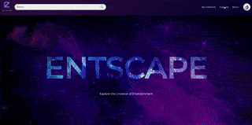
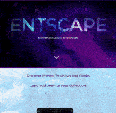

# Entscape

Welcome to Entscape, a web-based application created as the final project of a full-stack web development course. Entscape is a collaborative effort of four developers: Gladys, Mihaela, Niko, and Yu-An.

## Technologies Used

Entscape utilizes a range of technologies in both the frontend and backend development:

### Frontend

    

### Backend

      

## About Entscape

Entscape is a portal designed for bookworms and cinephiles. It serves as a tribute to the joy of reading and watching movies, aiming to settle the age-old debate between books and movies.

With Entscape, we offer you a single platform to discover and explore both worlds of entertainment, allowing you to cross over to the other side of the universe where you can find new books to read, movies to watch, and endless opportunities to indulge in captivating stories and immersive experiences.

## Visiting Entscape

To get started with Entscape, please follow these steps:

1. Access Entscape in your web browser at the specified URL: https://entscape-frontend.onrender.com
2. Register through the registration form, adding your first and last name, desired username, E-mail and password.
3. add your preference and eplore the universe of entertainment!
4. when clicking on a title (a movie for example), we will show you whether there's a book related! and vise versa!
5. add your favourites to your collection! and share it with your friends!
6. you can change your profile information and photo in the settings!

In case you encounter any hiccups, please note that the registration form and the registration through other means such as google or facebook is under development.

## Contributors and Contacts

If you have any questions or inquiries about Entscape, feel free to reach out to any of the project developers:

- Gladys - [GitHub](https://github.com/GladysAW)
- Mihaela - [GitHub](https://github.com/m89mihaella)
- Niko - [GitHub](https://github.com/nikopanag)
- Yu-An - [GitHub](https://github.com/yuany2036)

Thank you for your interest in Entscape. We hope you enjoy using our web application!
